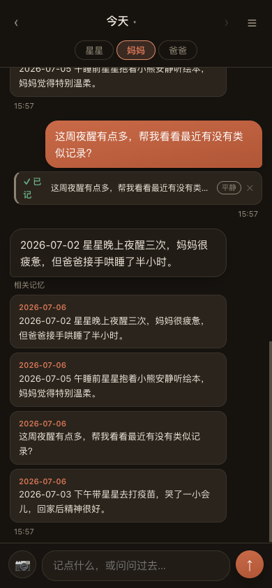
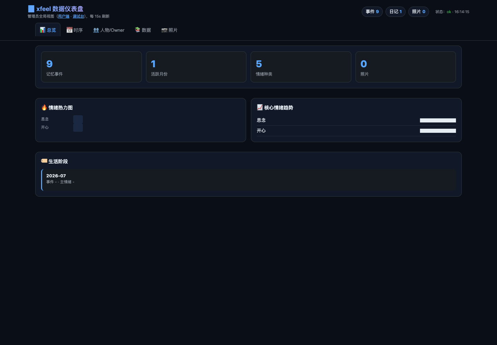

# xfeel — Family Memory Assistant

[中文文档](README.md)

xfeel is a self-hostable, long-term memory system for families: members chat naturally to log child milestones, daily care, moods, and meaningful moments — and the system distills scattered messages into structured, searchable, revisitable memories you can keep talking to.

It is both a mobile-first family journal and a private AI memory backbone: a growth archive for your kids, a co-parenting logbook, a mood retrospective, and a WeChat message archiver.

## Highlights

- **Frictionless logging** — write via web, HTTP API, or a WeChat Official Account; text and photos, no formatting required.
- **Automatic distillation** — recognizes milestones, sleep, feeding, health, emotions, and family relationships, producing long-term memory events.
- **Conversation with memory** — replies recall relevant past moments, so the assistant picks up context and shared history.
- **End-of-day archiving** — summarizes each day's conversation into a family diary and writes structured events back.
- **Mood & growth review** — browse trends by time, person, tag, and emotion, with per-member perspectives.
- **Local-first** — runs on SQLite + FTS5 with rule-based fallbacks when no LLM is available; built for self-hosting.

## Screenshots

| Family app (mobile-first) | Admin dashboard |
|---|---|
|  |  |

## Quick start

```bash
# 1. Install dependencies (requires Bun ≥ 1.1)
bun install

# 2. Configure (defaults to local Ollama; any OpenAI-compatible API works)
cp .env.example .env

# 3. Initialize the database
bun run db:init

# 4. Start the API + web app
bun run api

# 5. (Optional) import bundled synthetic demo diaries
bun run import:quick
```

Then open `http://localhost:3100/app` (family app) or `/dashboard` (admin view).

### Docker

```bash
cp .env.example .env
docker compose up -d
# or with a containerized Ollama:
docker compose --profile ollama up -d
```

## LLM configuration

See [.env.example](.env.example) for the full list. Core settings:

```bash
# Local Ollama (default)
LLM_BASE_URL=http://localhost:11434
LLM_MODEL=gemma3:12b

# Or any OpenAI-compatible endpoint
LLM_BASE_URL=https://api.example.com/v1
LLM_MODEL=claude-sonnet-5
LLM_API_KEY=your_key_here
```

**Graceful degradation**: when the LLM is unavailable, classification and extraction fall back to rule-based heuristics so the pipeline never blocks.

Note: the product experience is currently Chinese-first (prompts, vocabularies, and the web UI are in Chinese). Internationalization is on the roadmap — contributions welcome.

## Architecture

The core loop: same-day conversation → structured extraction → searchable memory → end-of-day archive. Every family's member names and nicknames are resolved at runtime from the `family_members` / `member_aliases` tables — nothing about your family is hardcoded.

- [docs/architecture-2026-06.md](docs/architecture-2026-06.md) — latest architecture & data flow
- [docs/project-flow.md](docs/project-flow.md) — module responsibilities and end-to-end flow
- [docs/wechat-channel.md](docs/wechat-channel.md) — WeChat Official Account channel setup

## Contributing

See [CONTRIBUTING.md](CONTRIBUTING.md). Issues and PRs in English are welcome.

## License

[MIT](LICENSE)
