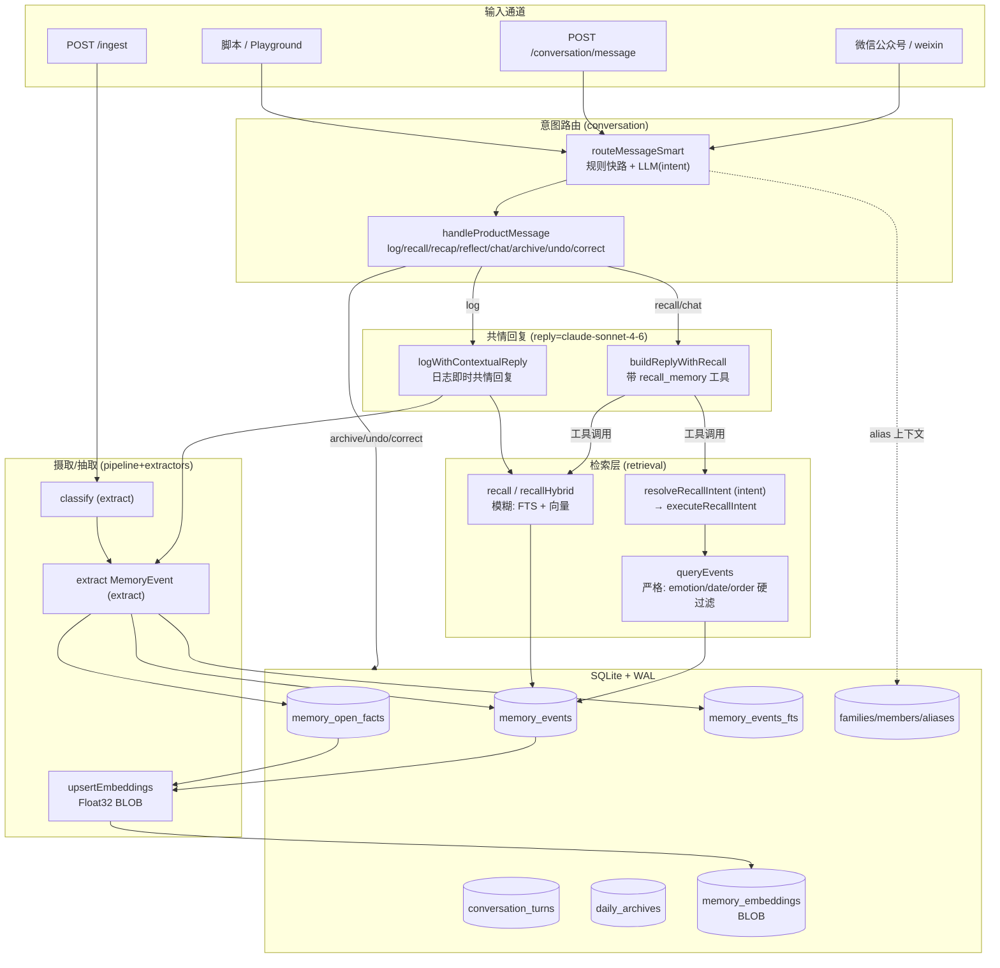
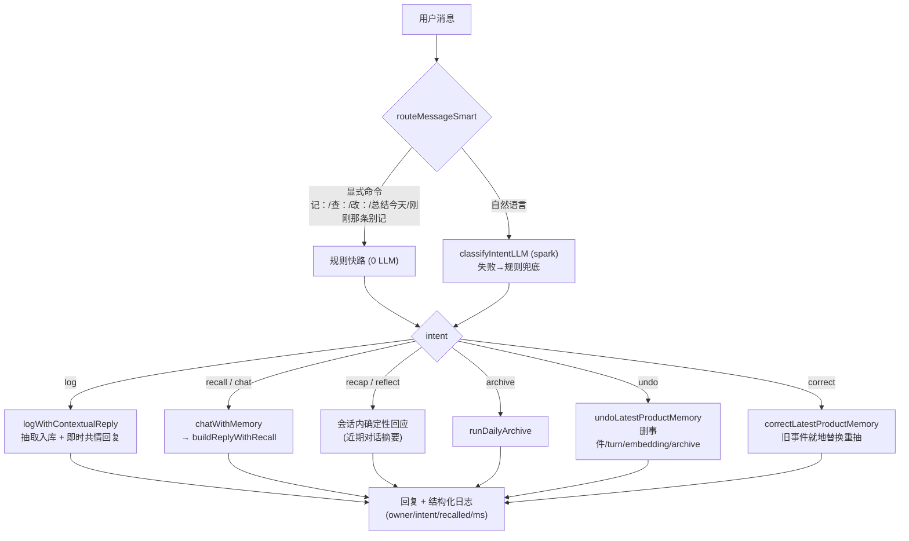
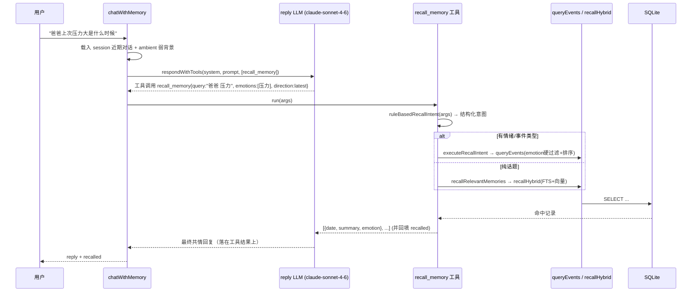
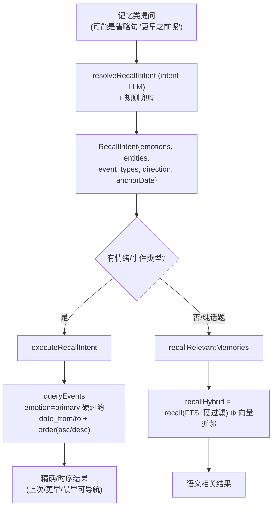
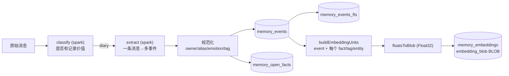

# xfeel 架构与数据流（2026-06 更新）

本文按**当前代码**重画整体架构与核心数据流，覆盖近期改动：LLM 按角色分模型、意图路由（规则+LLM）、检索意图识别（结构化 `queryEvents` vs 模糊 `recall`）、共情回复按需调用 recall 工具、embedding 改 Float32 BLOB 存储、服务端结构化日志。

> 与 `architecture.md` 的关系：那篇仍是摄取/存储/eval 的底盘说明；本篇侧重**对话与召回链路**的新结构，遇冲突以本篇为准。

---

## 1. 设计要点（在原则上的增量）

- **SQLite + WAL 是事实源**；LLM/embedding 是无状态工具，可失败可替换。
- **LLM 按角色分工**（不同模型/温度）：抽取与意图识别用便宜确定的小模型，共情回复用最强模型。
- **两套检索器各司其职**：`queryEvents` 做精确/时序硬过滤，`recall/recallHybrid` 做模糊语义召回；按"检索意图"分流。
- **召回是常态而非例外**：日志默认联动相关历史，弱匹配由 relevance-gate 过滤。
- **回复模型自带 recall 工具**：共情回复可自己决定何时、检索什么，而非只靠预取。
- **owner 硬过滤**贯穿所有召回。

### LLM 角色表（`packages/ai-client/src/roles.ts`）

| 角色 | 默认模型 | 温度 | 用途 | 调用点 |
|------|----------|------|------|--------|
| `extract` | `claude-sonnet-4-6` | 0.1 | 消息分类 + 结构化抽取 | `extractors/classify.ts`、`extract.ts` |
| `intent` | `claude-sonnet-4-6` | 0.1 | 自然语言意图 + 检索意图识别 | `intent-classifier.ts`、`recall-intent.ts` |
| `reply` | `claude-sonnet-4-6` | 0.7 | 共情回复（带工具调用） | `conversation.ts`、`contextual-response.ts` |

模型名可用 `XFEEL_MODEL_EXTRACT/INTENT/REPLY` 覆盖；协议用 `LLM_PROTOCOL=chat|responses`。

---

## 2. 总体分层

---

## 3. 数据流 A：产品消息闭环 `/conversation/message`

入口统一处理「记 / 查 / 总结今天 / 撤销 / 改 / 普通聊天」。

---

## 4. 数据流 B：共情回复按需调用 recall 工具（核心）

回复模型（claude-sonnet-4-6）不再只吃预取结果，而是**自己决定**何时、检索什么。

- 协议：`respondWithTools` 支持 **Chat Completions** 与 **Responses API**（`LLM_PROTOCOL=responses`）；Ollama/无工具退化为单轮直答。
- 失败兜底：工具/模型不可用时回退「预取召回（`recallByIntent ?? recallRelevantMemories`）+ 单轮 `buildReply`」。
- 日志路径（`logWithContextualReply`）目前是预取式：`recallContextualHistory`（默认开启，relevance-gate 过滤）+ 注入 session/ambient 的 `buildContextualReply`。

---

## 5. 数据流 C：检索意图识别与双层召回

要点：

- **`recall()` 打分修复**：`emotions` 现在是**硬过滤**（对齐 `valence`），并接入降级阶梯；之前只 +3 软加权，会被 recency/owner 高分淹没。
- **方向词映射**：上次=`newest`、更早=`date_to=锚点-1` 倒序、最早=`order asc`；锚点（如上一轮回答里的日期）由 LLM 或规则从近期对话中解析。
- **省略句**：`recentDialogue` 同时喂给意图识别与回复模型，"更早之前呢"能继承上文话题与锚点。

---

## 6. 数据流 D：摄取 / 抽取 / Embedding

**Embedding 存储修复**：向量从十进制 JSON 文本（~12.7KB/1024维）改为 **Float32 BLOB**（4KB），无损、同语义、约 3× 缩减。读路径 `readEmbeddingVector` 优先 BLOB、回退旧 JSON；迁移脚本 `migrate-embeddings-to-blob.ts` 就地转换 + VACUUM（实测 634MB→245MB）。

---

## 7. 存储模型（关键表）

| 表 | 角色 |
|----|------|
| `memory_events` | 结构化事件（事实源，召回主对象） |
| `memory_open_facts` | typed 长尾事实 |
| `conversation_turns` | 当天持续对话（含 metadata: mode/pipeline_message_id/event_ids） |
| `daily_archives` / `diaries` | 日终归档与原文 |
| `memory_events_fts` | FTS5 词面检索 |
| `memory_embeddings` | 向量（**Float32 BLOB**），每事件多 unit |
| `families / family_members / member_aliases / speaker_profiles / family_settings` | 家庭 onboarding 与称呼/别名解析 |
| `entities / entity_events / causal_chains / pipeline_status` | 实体图谱、因果、管线状态 |

---

## 8. 可观测性（pm2 排查）

- 结构化 JSON 日志，`LOG_LEVEL` 控级别，ISO 时间戳。
- 全局 `setErrorHandler`：未捕获异常带 reqId + 堆栈 + 路由。
- `onResponse`：慢请求（≥5s）/5xx 自动 warn。
- `/conversation/message` 主链路一行业务日志：`owner / intent / recalled / ms / 文本预览`；失败带完整堆栈。
- 微信后台异步失败：`[wechat]` 前缀 + openid + 堆栈。

---

## 9. 关键模块索引

| 关注点 | 文件 |
|--------|------|
| 角色模型/协议 | `packages/ai-client/src/roles.ts`、`llm.ts`（`respondWithTools`） |
| 意图路由 | `conversation/src/intent-router.ts`、`intent-classifier.ts` |
| 产品闭环 | `conversation/src/product-loop.ts` |
| 共情回复+工具 | `conversation/src/conversation.ts`（`buildReplyWithRecall`） |
| 日志即时回复 | `conversation/src/contextual-response.ts` |
| 检索意图 | `conversation/src/recall-intent.ts` |
| 严格检索 | `retrieval/src/events-query.ts` |
| 模糊检索 | `retrieval/src/recall.ts` |
| 会话上下文 | `conversation/src/session-context.ts` |
| 相关性门 | `conversation/src/relevance-gate.ts` |
| 摄取管线 | `pipeline/src/pipeline.ts` |
| Embedding | `scripts/embedding-common.ts`、`migrate-embeddings-to-blob.ts` |
| HTTP 入口/日志 | `apps/ingest-api/src/server.ts` |
