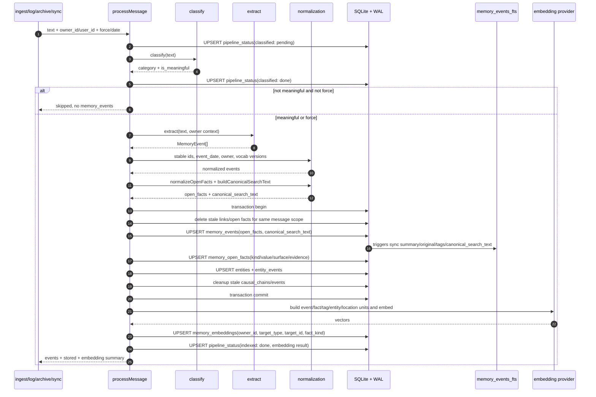
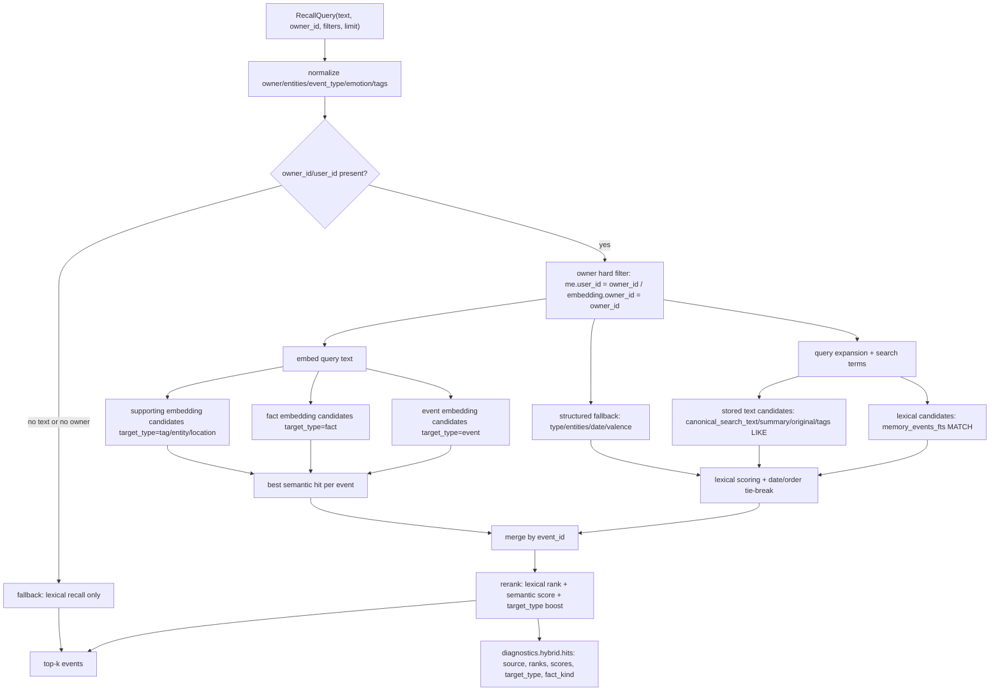
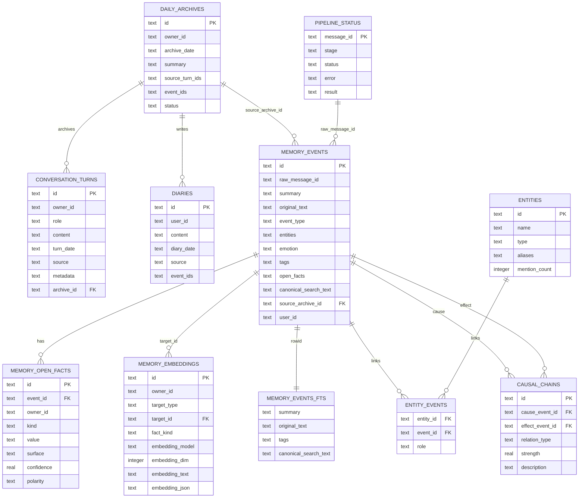
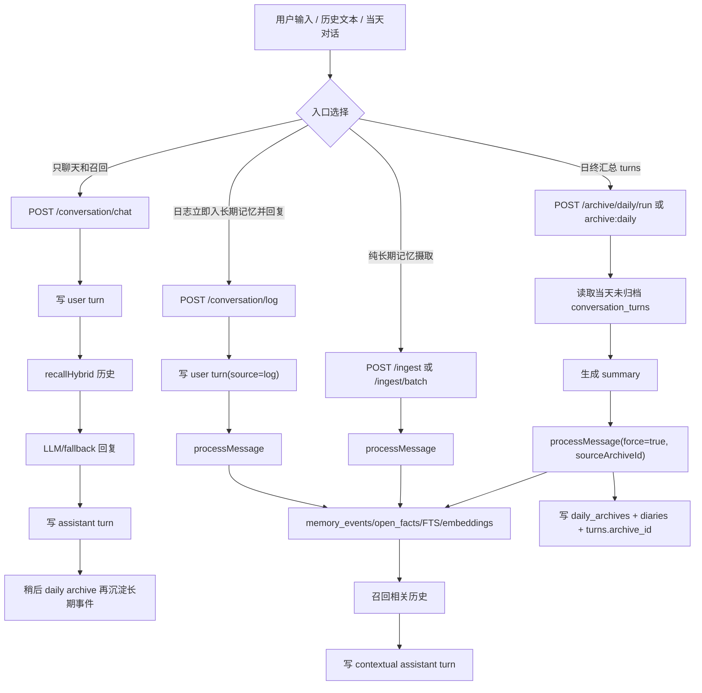
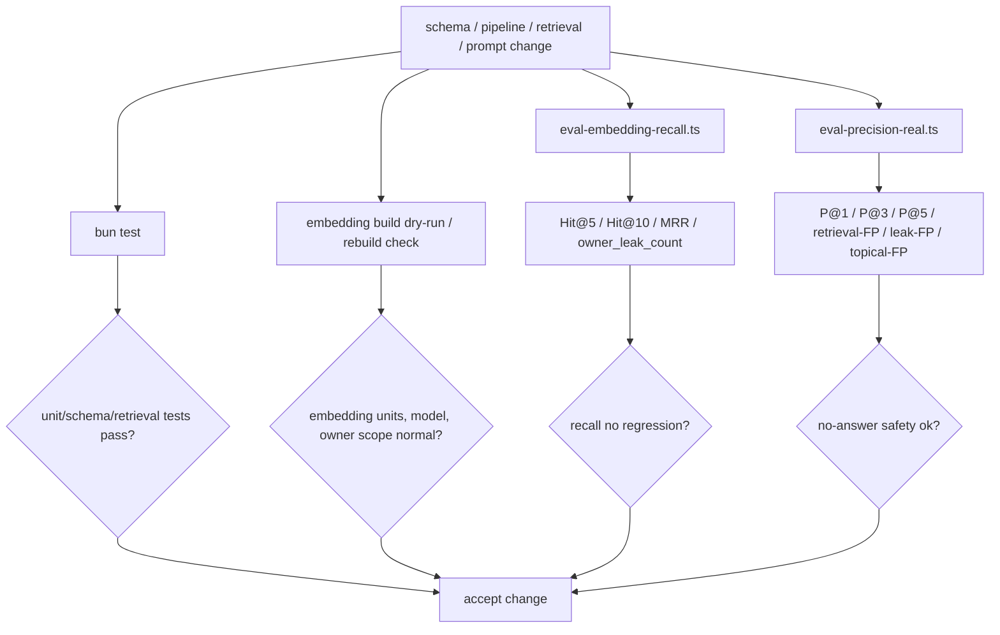

# xfeel-v3 当前架构

> 📌 对话与召回链路已更新，请优先看 [architecture-2026-06.md](architecture-2026-06.md)（角色分模型、意图路由、检索意图识别、带工具的共情回复、BLOB embedding）。本篇保留摄取/存储/eval 底盘说明。

`xfeel-v3` 是 Bun/TypeScript 的家庭记忆、情绪日志和成长记录系统。当前架构的核心是：用 SQLite + WAL 保存事实，用结构化事件、typed open facts、FTS5 和 embeddings 共同支撑召回；LLM 和 embedding provider 都只是无状态工具，不保存主状态。

## 设计原则

1. **SQLite + WAL 是事实源**：`memory_events`、`memory_open_facts`、`conversation_turns`、`daily_archives`、`diaries` 等表是系统状态；FTS 和 embeddings 都从事实层派生。
2. **LLM/embedding provider 是无状态工具**：分类、抽取、回复、summary、embedding 生成可以失败或替换，但不能成为主存储。
3. **owner hard filter 是硬约束**：`owner_id`/`user_id` 必须在 lexical、semantic、hybrid recall 中先过滤，不能由 embedding 相似度绕过。
4. **结构化字段 + open facts + embeddings 混合**：稳定字段服务精确过滤；typed open facts 承接长尾事实；FTS 和 embeddings 补足中文词面、同义表达和语义近邻。
5. **新增事件自动补 embedding**：`processMessage` 写入事件后默认对 event-level 和 fact-level 等 embedding units 做增量 upsert。
6. **eval 防 regress**：召回和 precision/no-answer 安全集用固定指标看质量，尤其关注 owner leak、无答案误召回和 top-k 排名。

## 总体分层架构

```mermaid
flowchart TB
    subgraph Channels["channels / 输入"]
        WX["微信 adapter"]
        Manual["curl / CLI / Playground"]
    end

    subgraph API["API / scripts"]
        Ingest["POST /ingest"]
        Batch["POST /ingest/batch"]
        Chat["POST /conversation/chat"]
        Log["POST /conversation/log"]
        ArchiveAPI["POST /archive/daily/run"]
        Query["/recall /events /stats /analytics"]
        EmbeddingBuild["build-memory-embeddings.ts"]
    end

    subgraph Runtime["runtime / 编排"]
        Conversation["conversation service"]
        Pipeline["processMessage"]
        DailyArchive["daily archive"]
        Retrieval["recall / recallHybrid"]
        Analyzer["analyzer / causal discovery"]
    end

    subgraph Extraction["extraction / 标准化"]
        Classify["classify"]
        Extract["extract MemoryEvent"]
        Normalize["normalize owner / entities / emotion / tags"]
        OpenFacts["typed open facts"]
        SearchText["canonical_search_text"]
    end

    subgraph Storage["storage / SQLite + WAL"]
        Turns[(conversation_turns)]
        Archives[(daily_archives)]
        Diaries[(diaries)]
        Events[(memory_events)]
        Facts[(memory_open_facts)]
        FTS[(memory_events_fts)]
        Embeddings[(memory_embeddings)]
        Entities[(entities / entity_events)]
        Causal[(causal_chains)]
        Status[(pipeline_status)]
    end

    subgraph RetrievalLayer["retrieval / 召回"]
        Lexical["FTS5 + stored text"]
        EventVec["event embedding recall"]
        FactVec["fact embedding recall"]
        Merge["merge / rerank"]
        Diagnostics["per-hit diagnostics"]
    end

    subgraph Eval["eval / quality gate"]
        UnitTests["bun test"]
        RecallEval["eval-embedding-recall.ts"]
        PrecisionEval["eval-precision-real.ts"]
        DryRun["embedding dry-run / rebuild check"]
    end

    subgraph Tools["stateless tools"]
        LLM["LLM classify/extract/reply/summary"]
        EmbedProvider["embedding provider"]
    end

    WX --> Chat
    WX --> Log
    Manual --> Ingest
    Manual --> Chat
    Manual --> ArchiveAPI
    Ingest --> Pipeline
    Batch --> Pipeline
    Log --> Conversation
    Log --> Pipeline
    Chat --> Conversation
    ArchiveAPI --> DailyArchive
    Query --> Retrieval
    EmbeddingBuild --> Embeddings

    Conversation --> Turns
    Conversation --> Retrieval
    DailyArchive --> Turns
    DailyArchive --> Pipeline
    DailyArchive --> Archives
    DailyArchive --> Diaries
    Pipeline --> Classify
    Classify --> LLM
    Pipeline --> Extract
    Extract --> LLM
    Extract --> Normalize
    Normalize --> OpenFacts
    Normalize --> SearchText
    Pipeline --> Events
    Pipeline --> Facts
    Pipeline --> Entities
    Pipeline --> Status
    Events --> FTS
    Pipeline --> EmbedProvider
    EmbedProvider --> Embeddings
    Analyzer --> Causal

    Retrieval --> Lexical
    Retrieval --> EventVec
    Retrieval --> FactVec
    Lexical --> FTS
    Lexical --> Events
    EventVec --> Embeddings
    FactVec --> Embeddings
    Merge --> Diagnostics
    Retrieval --> Merge
    Merge --> Query

    UnitTests --> Storage
    RecallEval --> Retrieval
    PrecisionEval --> Retrieval
    DryRun --> Embeddings
```

## processMessage 摄取流程

`processMessage` 是长期记忆写入主入口。`/ingest`、`/conversation/log`、批量导入和 daily archive 都会进入这条链路。

关键点：

- `memory_events` 是结构化事件主表，`open_facts` 字段保留事件内 facts 快照。
- `memory_open_facts` 是 typed open facts 事实层，便于按 `kind/value/owner_id` 查询和生成 fact-level embeddings。
- `canonical_search_text` 是规范化检索文本，会进入 `memory_events_fts`。
- `memory_events_fts` 由 SQLite FTS5 触发器跟随 `memory_events` 同步。
- `memory_embeddings` 保存 owner-scoped embedding units；新增事件默认自动补 embedding，可通过脚本重建或干跑验证。

## hybrid recall 数据流

`recallHybrid` 以 owner hard filter 为边界，合并三路候选：lexical、event embedding、fact embedding。实现上 embeddings 存在同一张 `memory_embeddings` 表，`target_type` 区分 event/fact/tag/entity/location；召回会按 event 聚合最佳 semantic hit。

硬约束：

- lexical SQL 的 hard filter 在候选生成前拼入 `WHERE me.user_id = ?`。
- embedding SQL 在扫描向量前使用 `WHERE embedding_model = ? AND owner_id = ?`。
- 没有 text 或没有 owner 时，`recallHybrid` 不走 semantic recall，避免跨 owner 语义扫描。
- diagnostics 只解释候选来源和分数，不改变 owner 隔离边界。

## 存储和数据模型

补充说明：

- `memory_events.user_id` 是长期事件的 owner 过滤字段，兼容历史命名；API 层仍接受 `owner_id`。
- `daily_archives.event_ids` 和 `diaries.event_ids` 是 JSON 文本引用，不是数据库外键。
- `memory_events_fts` 是 FTS5 虚表，由触发器维护，不是新的事实源。
- `memory_embeddings.embedding_json` 当前保存在 SQLite sidecar 表内，仍受 `owner_id` 约束。

## 运行时入口选择

入口差异：

- `/conversation/chat` 只写 `conversation_turns`，召回历史生成回复，不直接写 `memory_events`。
- `/conversation/log` 会写 turn、立即 `processMessage` 入长期记忆，再基于相关历史生成短回复。
- `/ingest` 是纯摄取入口，直接分类、抽取、写长期事件。
- `daily archive` 汇总当天 turns，写 `daily_archives/diaries`，再通过 `processMessage(force=true)` 进入长期事件层。

## eval 和 quality gate

推荐看法：

- `eval-embedding-recall.ts` 关注能否召回应该命中的长期记忆：`Hit@5`、`Hit@10`、`MRR`、`owner_leak_count`。
- `eval-precision-real.ts` 关注 no-answer 安全集和误召回：`P@1/P@3/P@5`、`retrieval-FP`、`leak-FP`、`topical-FP`。
- embedding dry-run 或 rebuild check 用来确认 `memory_embeddings` 是否覆盖 event/fact units，并保持模型和维度一致。
- 单元测试覆盖 schema migration、FTS、pipeline 幂等、owner filter、retrieval scoring 等底线行为。

## 当前边界

- 当前不引入远端主数据库、独立向量数据库、外部队列或工作流平台。
- embedding 召回仍是 SQLite sidecar JSON vector 扫描，适合当前家庭记忆规模；未来如果规模超过 SQLite 承载，再迁移索引实现。
- FTS 和 embeddings 是召回索引，不是事实层；事实修正应回写 `memory_events` / `memory_open_facts`。
- owner 隔离优先级高于召回率，任何 semantic/hybrid 优化都必须先满足 owner hard filter。
