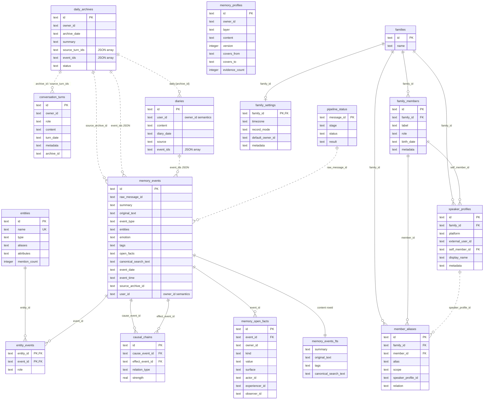
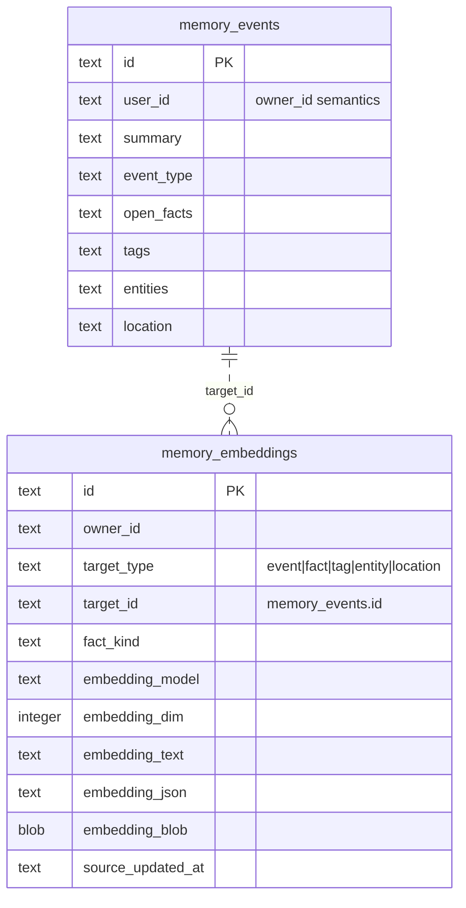

# 数据库表关系图

Schema 来源：

- 主 SQLite 库：`packages/db/src/schema.ts`
- 向量 sidecar 库：`packages/db/src/database.ts`

图例：

- 实线表示 SQLite schema 中声明的外键；`memory_events_fts` 例外，它是由触发器维护的 FTS5 content table。
- 虚线表示应用层引用：JSON ID 数组、同 owner 关联、跨库关联，数据库不会强制校验。
- `memory_events.user_id` 是历史列名，实际语义等同 API 层的 `owner_id`。

## 主库

## 向量 Sidecar 库

`memory_embeddings` 位于向量 sidecar 库中，默认文件是 `xfeel.vec.db`。它和主库分离，因此它到 `memory_events` 的关系由应用代码维护，不是 SQLite 外键。

embedding 单元的 ID 由事件 ID 派生，例如：

- `${event_id}:event`
- `${event_id}:fact:${stable_key}`
- `${event_id}:tag:${stable_key}`
- `${event_id}:entity:${stable_key}`
- `${event_id}:location:${stable_key}`
