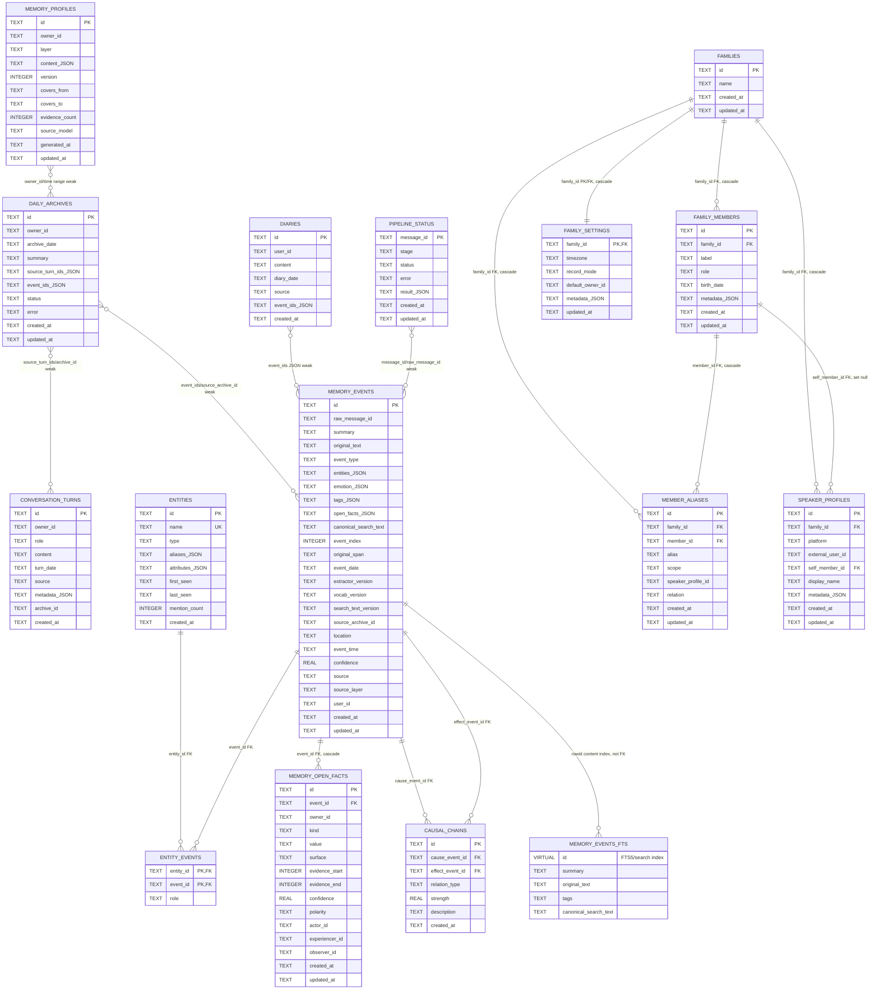

# xfeel-v3 SQLite 数据表及关系

本文依据 `packages/db/src/schema.ts` 以及本地 `data/xfeel.db` 的真实 `sqlite_master` schema 推断。重点覆盖主 SQLite 库中的事实表、归档表、家庭/说话人表和检索索引；向量库中的 `memory_embeddings` 不在本文范围内。

## ER 图

## 关系说明

数据库真正声明的外键只有这些：

| 子表 | 字段 | 父表 | 删除行为 |
| --- | --- | --- | --- |
| `entity_events` | `entity_id` | `entities.id` | 默认 |
| `entity_events` | `event_id` | `memory_events.id` | 默认 |
| `causal_chains` | `cause_event_id` | `memory_events.id` | 默认 |
| `causal_chains` | `effect_event_id` | `memory_events.id` | 默认 |
| `memory_open_facts` | `event_id` | `memory_events.id` | `ON DELETE CASCADE` |
| `family_members` | `family_id` | `families.id` | `ON DELETE CASCADE` |
| `member_aliases` | `family_id` | `families.id` | `ON DELETE CASCADE` |
| `member_aliases` | `member_id` | `family_members.id` | `ON DELETE CASCADE` |
| `speaker_profiles` | `family_id` | `families.id` | `ON DELETE CASCADE` |
| `speaker_profiles` | `self_member_id` | `family_members.id` | `ON DELETE SET NULL` |
| `family_settings` | `family_id` | `families.id` | `ON DELETE CASCADE` |

以下是逻辑引用或 JSON 弱关系，不是数据库外键，SQLite 不会自动校验或级联：

| 字段 | 弱关系含义 |
| --- | --- |
| `conversation_turns.archive_id` | 通常指向 `daily_archives.id`，用于标记 turn 已归档，但没有 FK。 |
| `daily_archives.source_turn_ids` | JSON 数组，保存参与归档的 `conversation_turns.id`。 |
| `daily_archives.event_ids` | JSON 数组，保存归档抽取出的 `memory_events.id`。 |
| `diaries.event_ids` | JSON 数组，保存日记或导入内容对应的事件 id。 |
| `memory_events.raw_message_id` | 管线输入 id，常与 `pipeline_status.message_id`、对话 turn id、导入批次 id 或归档 id 对齐。 |
| `memory_events.source_archive_id` | 归档抽取事件通常记录来源 `daily_archives.id`。 |
| `memory_events.user_id`、`conversation_turns.owner_id`、`daily_archives.owner_id`、`memory_open_facts.owner_id`、`memory_profiles.owner_id` | 同一个 owner 概念在不同表中的列名；没有统一 owner 表约束。 |
| `memory_events.entities` | JSON 数组；与 `entities`/`entity_events` 有冗余表达，但不是 FK。 |
| `memory_events.open_facts` | JSON 数组；与 `memory_open_facts` 是冗余/派生表达，不是 FK。 |
| `memory_open_facts.actor_id`、`experiencer_id`、`observer_id` | open fact 内部参与者标识；当前 schema 没有指向成员或实体表的 FK。 |
| `member_aliases.speaker_profile_id` | 当 `scope='speaker'` 时表示别名作用域，但当前 schema 没有 FK 到 `speaker_profiles.id`。 |
| `family_settings.default_owner_id` | 默认 owner 标识；当前 schema 没有 FK 到 `speaker_profiles` 或独立 owner 表。 |
| `pipeline_status.result`、`conversation_turns.metadata`、`memory_profiles.content`、`family_* .metadata` | JSON 文本，可能包含更多 id 或状态信息，均非 FK。 |

## 核心表用途

| 表 | 用途 | 关键约束/索引 |
| --- | --- | --- |
| `conversation_turns` | 当天持续对话和日志原文。 | `role` 限定为 `user/assistant/system`；索引 `idx_conversation_owner_date(owner_id, turn_date)`、`idx_conversation_archive(archive_id)`。 |
| `daily_archives` | owner 某天的日终归档结果。 | `UNIQUE(owner_id, archive_date)`；索引 `idx_daily_archives_owner_date(owner_id, archive_date)`。 |
| `memory_events` | 长期记忆事件事实主表。 | 主键 `id`；索引覆盖 `event_type`、`event_time`、`user_id`、`raw_message_id/event_index`、`user_id/event_date`、`source_archive_id`。 |
| `memory_open_facts` | 从事件中规范化出的 typed open facts。 | `event_id` 外键级联删除；索引 `event_id`、`owner_id/kind`、`value`。 |
| `entities` | 实体字典，按 `name` 去重。 | `name` 唯一；索引 `idx_entities_name(name)`。 |
| `entity_events` | 实体和事件的多对多关联。 | 复合主键 `(entity_id, event_id)`；两个字段均为 FK。 |
| `causal_chains` | 事件之间的因果或触发关系。 | `cause_event_id`、`effect_event_id` 都指向 `memory_events.id`。 |
| `diaries` | 导入日记或日终归档生成的日记文本。 | 索引 `idx_diaries_date(diary_date)`；`event_ids` 是 JSON 弱引用。 |
| `pipeline_status` | 记录每条管线输入的当前阶段、状态、错误和 JSON 结果。 | 主键 `message_id`；索引 `idx_pipeline_stage(stage, status)`。 |
| `memory_profiles` | L3 长期理解 / L2 近期状态画像快照。 | `layer` 限定为 `long_term/recent`；`UNIQUE(owner_id, layer)`。 |
| `families` | 家庭根实体。 | 主键 `id`。 |
| `family_members` | 家庭成员。 | `UNIQUE(family_id, label)`；`family_id` 级联到 `families`。 |
| `member_aliases` | 成员别名和称呼，支持全局或说话人作用域。 | `scope` 限定为 `global/speaker`；`family_id`、`member_id` 均级联。 |
| `speaker_profiles` | 外部平台用户和家庭成员的映射。 | `UNIQUE(platform, external_user_id)`；`self_member_id` 删除时置空。 |
| `family_settings` | 家庭配置。 | `family_id` 同时是 PK 和 FK；`record_mode` 限定为 `conservative/balanced/verbose`。 |

## `memory_events_fts`

`memory_events_fts` 是 SQLite FTS5 虚表，不是事实源。真实库中定义为：

- 列：`summary`、`original_text`、`tags`、`canonical_search_text`
- `content=memory_events`
- `content_rowid=rowid`
- tokenizer 当前为 `trigram`；代码会在不支持 `trigram` 时回退到 `unicode61`

它由三个触发器维护：

| 触发器 | 时机 | 作用 |
| --- | --- | --- |
| `memory_events_ai` | `AFTER INSERT ON memory_events` | 插入对应 FTS 行。 |
| `memory_events_ad` | `AFTER DELETE ON memory_events` | 向 FTS 写入 delete 指令。 |
| `memory_events_au` | `AFTER UPDATE ON memory_events` | 先删除旧 FTS 行，再插入新 FTS 行。 |

因此查询可以把 `memory_events_fts.rowid` 与 `memory_events.rowid` 对齐，但这不是外键关系，也不应把 FTS 表当作独立事实表修改。
