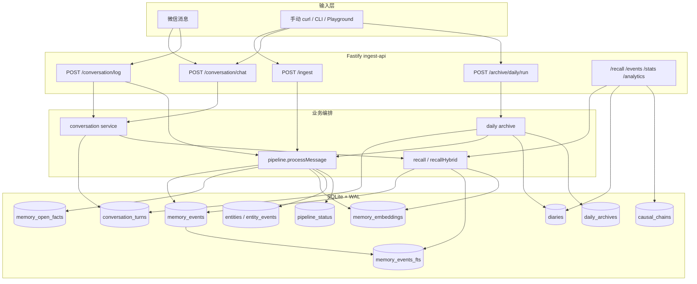
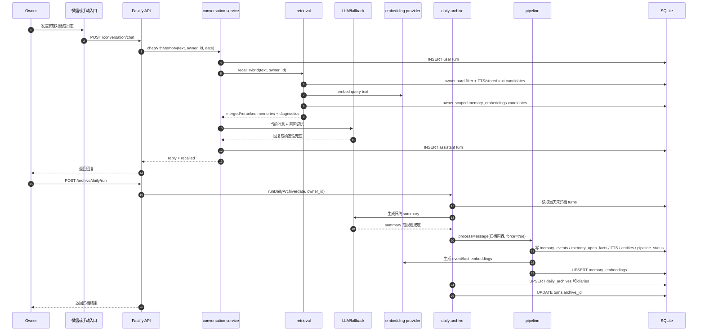
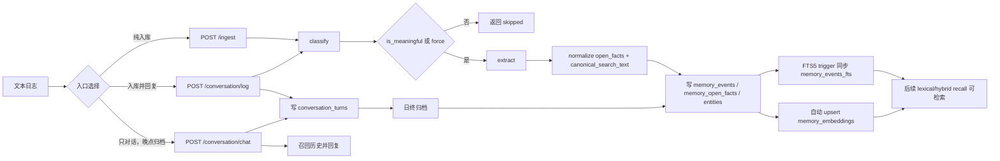

# xfeel-v3 项目流程说明

这份文档面向项目 owner，用来快速建立全局视角：这个 Bun/TypeScript 项目如何把微信或手动输入的家庭对话，沉淀成事件记忆、支持召回，并在日终归档后更新长期事实层。

## 项目定位

`xfeel-v3` 是家庭情绪日志、成长记录和知识图谱的记忆管线。它的核心不是保存一段 LLM 上下文，而是把每天的持续对话稳定写入 SQLite，再通过结构化事件、typed open facts、FTS5、embeddings、日终归档和分析接口支撑后续回顾。

几个关键判断：

- SQLite 是当前事实源，默认路径是 `data/xfeel.db`，可用 `XFEEL_DB_PATH` 覆盖。
- LLM 和 embedding provider 是无状态工具，不是主状态存储。LLM 失败时，分类、抽取、回复和归档都有规则或确定性兜底。
- `memory_events` 是结构化事件主表，`memory_open_facts` 是 typed open facts 事实层，`memory_embeddings` 保存 event-level 和 fact-level 等 embedding units。
- `memory_events_fts` 是从 `memory_events` 派生的 FTS5 lexical recall 索引，`canonical_search_text` 会进入 FTS 和 stored-text recall。
- `owner_id` 是记录归属人。兼容历史字段时，`memory_events.user_id` 和 `diaries.user_id` 语义上也是 owner。
- owner 隔离是 hard filter，semantic/hybrid recall 不能绕过 `owner_id`/`user_id` 过滤。
- 已知 owner 映射：`demo-dad-owner = 爸爸`，`demo-mom-owner = 妈妈`。
- 当前仓库提供统一 HTTP API 和脚本入口。微信入口应作为 channel adapter，把平台消息转换成这些统一 API payload。

## 一眼看懂



最重要的区别：

- `/conversation/chat` 只记录当天对话并用 `recallHybrid` 召回历史生成回复，不直接写长期事件。
- `/conversation/log` 会记录对话、立即跑抽取入长期事件，并基于 `recallHybrid`/结构化召回生成短回复。
- `/ingest` 是纯记忆摄取入口，直接分类、抽取、写事件、open facts、FTS 和 embeddings。
- `/archive/daily/run` 把当天未归档的 conversation turns 汇总成日记，再抽取为长期事件。

## 模块职责

| 模块 | 主要职责 | 关键文件 |
| --- | --- | --- |
| API 服务 | 暴露摄取、对话、归档、查询、分析和测试界面 | `apps/ingest-api/src/server.ts` |
| 管线编排 | `classify -> extract -> normalize/open facts/canonical_search_text -> store -> upsert embeddings`，维护 `pipeline_status` | `packages/pipeline/src/pipeline.ts` |
| 对话服务 | 记录当天 turns、用 `recallHybrid` 召回历史、生成回复 | `packages/conversation/src/conversation.ts` |
| 上下文日志回复 | 日志入库后用结构化和 hybrid 召回相关历史，生成微信可读短回复 | `packages/conversation/src/contextual-response.ts` |
| 日终归档 | 汇总 turns，生成 summary，写 daily archive 和 diary，再抽取事件 | `packages/archive/src/daily.ts` |
| 数据库层 | 初始化 SQLite schema、WAL、open facts、embeddings、索引和 FTS5 触发器 | `packages/db/src/schema.ts`, `packages/db/src/database.ts` |
| 检索层 | lexical recall、owner-scoped embedding recall、merge/rerank、diagnostics | `packages/retrieval/src/recall.ts`, `packages/retrieval/src/events-query.ts` |
| Embedding 工具 | 构建 event/fact/tag/entity/location embedding units，调用 provider 并写 `memory_embeddings` | `scripts/embedding-common.ts`, `scripts/build-memory-embeddings.ts` |
| 质量评估 | recall 和 precision/no-answer 安全集评估 | `scripts/eval-embedding-recall.ts`, `scripts/eval-precision-real.ts` |
| 分析层 | 归一化、因果链、热力图、趋势、阶段和图谱统计 | `packages/analyzer/src/index.ts` |
| 日终脚本 | CLI 方式触发日终归档 | `scripts/daily-archive.ts` |

`packages/conversation/src/index.ts` 和 `packages/archive/src/index.ts` 是导出入口，实际逻辑在同目录下的实现文件里。

## 端到端时序

下面的时序图展示推荐主链路：白天持续对话，晚上日终归档，最终沉淀为可召回的事件事实。



如果一条输入需要立刻成为长期事件，不等日终归档，可以使用 `/conversation/log` 或 `/ingest`：



## 数据流细节

### 1. 微信或手动输入

入口可以是微信 adapter、curl、脚本或 `/conversation/playground`。项目内部只关心统一字段：

- `text` 或 `content`：用户输入。
- `owner_id` 或兼容字段 `user_id`：记录归属人。
- `date`：对话和归档日期，建议显式传 `YYYY-MM-DD`。
- `force`：绕过 `classify` 的无意义过滤，强制抽取。

注意：代码里的默认业务日期使用本地日期（线上默认 `Asia/Shanghai`）。`created_at` 仍是 UTC 时间戳；查询在缺少 `event_date/event_time` 时会按本地时区把 `created_at` 兜底成业务日期。跨环境排查时建议 API 和脚本仍显式传 `date`。

### 2. 直接入长期记忆

`POST /ingest` 和 `/conversation/log` 都会调用 `processMessage`：

1. `classify(text)` 判断消息类别和是否有记录价值。
2. 如果 `is_meaningful=false` 且没有 `force=true`，返回 `skipped`，不写 `memory_events`。
3. `extract(text, ownerContext)` 抽取一个或多个 `MemoryEvent`。
4. 对事件做 owner、日期、版本、typed open facts 和 `canonical_search_text` 标准化。
5. 写入 `memory_events` 和 `memory_open_facts`，同时更新 `entities`、`entity_events`；`memory_events_fts` 由触发器同步。
6. 默认自动为新增事件 upsert `memory_embeddings`，覆盖 event-level、fact-level 以及 tag/entity/location units。
7. 更新 `pipeline_status` 阶段：`classified`、`extracted`、`indexed`，异常时写 `error`。

`/conversation/log` 额外会写一条 user turn，抽取完成后召回相关历史，再写一条 assistant turn。

### 3. 持续对话和召回

`POST /conversation/chat` 是当天对话闭环：

- 写入 user turn 到 `conversation_turns`。
- 判断当前输入更像问题还是新记忆。
- 通过 `recallHybrid` 按 owner hard filter 召回历史：lexical recall、event embedding recall、fact embedding recall 合并重排。
- 调 LLM 生成回复；失败时用确定性回复。
- 写入 assistant turn，并在 metadata 中保存召回事件 ID。

这条链路不会立即把用户消息抽取为 `memory_events`。长期沉淀发生在后续日终归档，或改用 `/conversation/log`。

### 4. 日终归档

`POST /archive/daily/run` 或 `bun run archive:daily` 调用 `runDailyArchive`：

- 如果传了 `owner_id`，只归档该 owner。没传 owner 时，扫描当天有未归档 turns 的 owner。
- 默认只读取 `archive_id IS NULL` 的 turns。`force=true` 会包含已归档 turns 并覆盖当天归档。
- 如果同一 owner 同一天已归档且没有 `force`，返回 `skipped: true`。
- 汇总 turns 生成 200 到 500 字 summary。LLM 失败时退回拼接用户消息的确定性 summary。
- 将“日期、记录者、当天总结、用户原始对话”再次送入 `processMessage(force=true)`，沉淀为事件、open facts、FTS 和 embeddings。
- 写 `daily_archives`，写一条 `diaries(source='daily_archive')`，并把相关 turns 标记 `archive_id`。

## 核心表说明

| 表 | 用途 | 关键字段 |
| --- | --- | --- |
| `memory_events` | 长期事件事实层，召回、图谱和分析的核心来源 | `summary`, `original_text`, `event_type`, `entities`, `emotion`, `tags`, `open_facts`, `canonical_search_text`, `event_time`, `source`, `source_layer`, `user_id` |
| `memory_open_facts` | typed open facts 事实层，承接结构化字段之外的长尾事实 | `event_id`, `owner_id`, `kind`, `value`, `surface`, `evidence_start`, `evidence_end`, `confidence`, `polarity` |
| `memory_embeddings` | event/fact/tag/entity/location embedding sidecar，用于 owner-scoped semantic recall | `owner_id`, `target_type`, `target_id`, `fact_kind`, `embedding_model`, `embedding_dim`, `embedding_text`, `embedding_json` |
| `entities` | 规范实体计数，如爸爸、妈妈、星星、禾禾 | `name`, `type`, `aliases`, `first_seen`, `last_seen`, `mention_count` |
| `entity_events` | 实体和事件的多对多关系 | `entity_id`, `event_id`, `role` |
| `conversation_turns` | 当天持续对话原始记录 | `owner_id`, `role`, `content`, `turn_date`, `source`, `metadata`, `archive_id` |
| `daily_archives` | owner 某天的归档结果 | `owner_id`, `archive_date`, `summary`, `source_turn_ids`, `event_ids`, `status`, `error` |
| `diaries` | 可读日记层，包含导入日记和日终 summary | `user_id`, `content`, `diary_date`, `source`, `event_ids` |
| `pipeline_status` | 每条消息的管线状态和错误记录 | `message_id`, `stage`, `status`, `error`, `result` |
| `causal_chains` | 分析层发现的因果线索 | `cause_event_id`, `effect_event_id`, `relation_type`, `strength`, `description` |
| `memory_events_fts` | FTS5 lexical recall 索引，由触发器随 `memory_events` 同步 | `summary`, `original_text`, `tags`, `canonical_search_text` |

JSON 字段以 TEXT 形式存储。常见字段结构：

```json
{
  "entities": ["星星", "妈妈"],
  "emotion": { "primary": "开心", "intensity": 0.8, "valence": "positive" },
  "tags": ["成长里程碑", "自主行走"],
  "open_facts": [
    { "kind": "milestone", "value": "自主走三步", "surface": "自己走了三步" }
  ]
}
```

当前检索有两层：

- `recall`：规范化查询后先套 owner/date/type/entity/valence hard filters，再用 FTS5、`canonical_search_text`/`summary`/`original_text`/`tags` stored text 和结构化 fallback 召回。
- `recallHybrid`：在 `recall` 的 lexical candidates 之外，对同一 owner 的 `memory_embeddings` 做 semantic candidates，合并 lexical、event embedding、fact embedding 等命中并返回 per-hit diagnostics。

## 关键 API

| API | 用途 | 主要写入 |
| --- | --- | --- |
| `POST /ingest` | 摄取单条文本，完整分类、抽取、入库并补 embedding | `memory_events`, `memory_open_facts`, `memory_embeddings`, `entities`, `entity_events`, `pipeline_status` |
| `POST /ingest/batch` | 批量摄取，单批最多 50 条 | 同 `/ingest` |
| `POST /recall` | lexical/structured 检索记忆，支持文本、实体、类型、情绪、标签、日期、owner | 只读 |
| `POST /conversation/turn` | 只记录一条对话 turn，不抽取长期事件 | `conversation_turns` |
| `POST /conversation/chat` | 记录用户消息，召回历史并生成回复 | `conversation_turns` |
| `POST /conversation/log` | 记录日志，立即抽取长期事件，再生成上下文回复 | `conversation_turns`, `memory_events`, `memory_open_facts`, `memory_embeddings`, `entities`, `pipeline_status` |
| `GET /conversation/turns` | 查询 turns，默认不包含已归档 turns | 只读 |
| `POST /archive/daily/run` | 对某天 turns 做日终归档并抽取事件 | `daily_archives`, `diaries`, `memory_events`, `memory_open_facts`, `memory_embeddings`, `conversation_turns.archive_id` |
| `GET /archive/daily` | 查询日终归档 | 只读 |
| `GET /events` | canonical events 查询，支持类型、实体、标签、情绪、owner、日期、分页 | 只读 |
| `GET /events/:id` | 查询单个事件 | 只读 |
| `GET /entities` | 查询实体列表 | 只读 |
| `GET /diaries` | 查询日记列表 | 只读 |
| `POST /normalize/run` | 批量归一化、去重和因果拆分 | 视 analyzer 实现写入 |
| `POST /analytics/causal/discover` | 发现因果链 | `causal_chains` |
| `GET /analytics/*` | 热力图、趋势、阶段、多人对比、实体演化、全局摘要 | 只读 |
| `GET /stats`, `/graph`, `/vocabulary`, `/health` | 统计、图谱、词表、健康检查 | 只读 |
| `GET /conversation/playground`, `/dashboard` | 本地测试界面和图谱仪表盘 | 只读页面 |

典型请求：

```bash
curl -X POST http://localhost:8000/conversation/chat \
  -H "Content-Type: application/json" \
  -d '{"text":"今天星星自己走了三步，我特别开心","owner_id":"demo-mom-owner","date":"2026-05-12"}'

curl -X POST http://localhost:8000/archive/daily/run \
  -H "Content-Type: application/json" \
  -d '{"date":"2026-05-12","owner_id":"demo-mom-owner","force":true}'

curl -X POST http://localhost:8000/recall \
  -H "Content-Type: application/json" \
  -d '{"entities":["星星"],"owner_id":"demo-mom-owner","limit":10}'
```

## 后台任务和运维入口

| 任务 | 命令或入口 | 说明 |
| --- | --- | --- |
| 初始化数据库 | `bun run db:init` | 创建 schema、索引和 FTS 触发器 |
| 启动 API | `bun run api` | 默认监听 `http://localhost:8000` |
| 日终归档 | `bun run archive:daily --date=2026-05-12 --owner=demo-mom-owner` | CLI 触发，与 API 同一套逻辑 |
| 日终试运行 | `bun run archive:daily --date=2026-05-12 --owner=demo-mom-owner --dry-run` | 生成 summary，不写归档和事件 |
| Embedding 重建 | `bun run scripts/build-memory-embeddings.ts --db data/xfeel.db --batch-size 32` | 从当前 `memory_events` 重建/补齐 `memory_embeddings` |
| Recall 评估 | `bun run scripts/eval-embedding-recall.ts --mode hybrid` | 看 `Hit@5`、`Hit@10`、`MRR`、`owner_leak_count` |
| Precision 评估 | `bun run scripts/eval-precision-real.ts --mode hybrid` | 看 `P@1/P@3/P@5`、`retrieval-FP`、`leak-FP`、`topical-FP` |
| UI 闭环测试 | `bun run test:ui` | 启动隔离库和本地服务，用浏览器操作页面 |
| 单元测试 | `bun test` | 跑 Bun test |

建议做验证或导入实验时使用隔离数据库：

```bash
XFEEL_DB_PATH=/tmp/xfeel-verify.db bun run db:init
XFEEL_DB_PATH=/tmp/xfeel-verify.db bun run api
```

## 常用排障入口

### 服务和数据库是否正常

```bash
curl http://localhost:8000/health
curl http://localhost:8000/stats
sqlite3 data/xfeel.db "select count(*) from memory_events;"
```

如果使用了 `XFEEL_DB_PATH`，所有命令必须在同一个进程启动前设置。`getDB()` 在进程内是单例，启动后再改环境变量不会切换数据库。

### 摄取后没有事件

先看 `/ingest` 返回：

- `skipped=true`：分类认为无记录价值。确认 `category` 和 `reason`，必要时加 `force:true`。
- `stored=0`：抽取没有产出事件，或异常前未完成存储。
- 500 错误：查 `pipeline_status` 的 `stage='error'`。

```bash
sqlite3 data/xfeel.db "select message_id,stage,status,result,error,updated_at from pipeline_status order by updated_at desc limit 10;"
```

### 召回为空或结果不对

优先检查：

- `owner_id` 是否和写入时一致。`memory_events.user_id` 是 owner 过滤字段。
- 是否误用了 `/conversation/chat`，它不会立即写 `memory_events`。
- `date_from`、`date_to` 是否和 `event_time` 格式匹配。
- 实体、情绪、标签在写入时会标准化，查询词可能需要换成规范词。
- semantic/hybrid 路径是否有同 owner 的 `memory_embeddings`，以及 embedding provider 是否可用。

```bash
curl -X POST http://localhost:8000/recall \
  -H "Content-Type: application/json" \
  -d '{"text":"夜醒","owner_id":"demo-mom-owner","limit":5}'

curl "http://localhost:8000/events?owner_id=demo-mom-owner&limit=5"

sqlite3 data/xfeel.db "select owner_id,target_type,count(*) from memory_embeddings group by owner_id,target_type;"
```

### 日终归档返回 skipped

常见原因：

- 同一 owner 同一天已经归档，未传 `force:true`。
- 当天没有未归档 turns。
- turns 被归档后，`GET /conversation/turns` 默认不返回，需要 `include_archived=true`。

```bash
curl "http://localhost:8000/conversation/turns?owner_id=demo-mom-owner&date=2026-05-12&include_archived=true"
curl "http://localhost:8000/archive/daily?owner_id=demo-mom-owner&date=2026-05-12"
```

### 日期和时区看起来不对

API 和脚本默认业务日期按本地时区生成；`created_at/updated_at` 是 UTC 存储，直接看前 10 位会和北京时间日期不一致。owner 操作和测试建议始终显式传：

- 对话：`date:"YYYY-MM-DD"`
- 归档：`date:"YYYY-MM-DD"` 或 `--date=YYYY-MM-DD`
- 查询：`date`、`since`、`until`、`date_from`、`date_to`

### LLM 或 embedding provider 不可用

LLM 不可用时项目会兜底，但抽取、summary 和回复质量会下降；embedding provider 不可用时，新增事件的 semantic recall 索引无法写入。检查：

- `.env` 里的 `LLM_BASE_URL`、`LLM_MODEL`、`LLM_API_KEY`。
- `XFEEL_EMBEDDING_MODEL`、`OLLAMA_BASE_URL` 是否和本地 embedding provider 一致。
- Ollama 本地服务是否启动。
- `/conversation/chat` 和 `/archive/daily/run` 返回是否使用了确定性 summary 或回复。
- `pipeline_status.result` 里是否有 embedding 写入数量或错误。

## Owner 常用操作顺序

```bash
bun install
bun run db:init
bun run api
```

打开测试页面：

```text
http://localhost:8000/conversation/playground
```

白天用 `/conversation/chat` 做对话闭环；需要立即沉淀为长期事件时用 `/conversation/log`；晚上用 `/archive/daily/run` 或 `bun run archive:daily` 做归档。归档完成后，用 `/recall`、`/events`、`/dashboard`、`/analytics/summary` 检查长期记忆是否进入事实层；召回质量变更再看 `eval-embedding-recall.ts` 和 `eval-precision-real.ts`。
